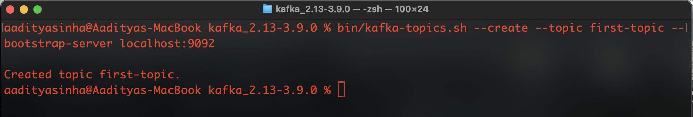
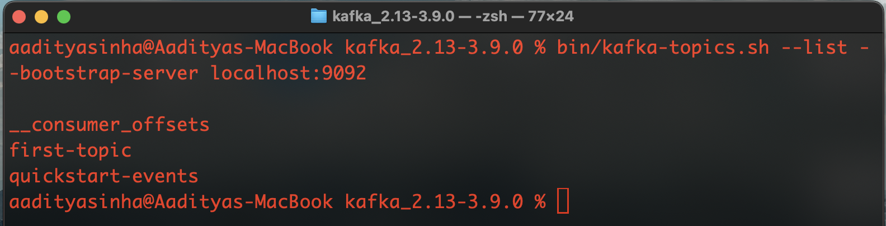
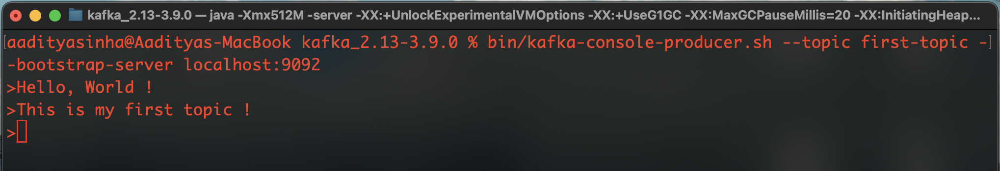
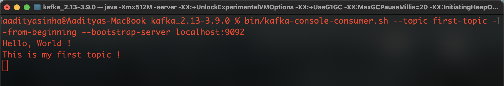

<p align="center">
<picture>
  <source media="(prefers-color-scheme: light)" srcset="public/kafka.png">
  <source media="(prefers-color-scheme: dark)" srcset="public/kafka.png">
   
</picture>
</p>

# Apache Kafka

This is a repository  for adding files and commands while learning Apache Kafka

### (1) Downloading Kafka
Kafka can be downloaded from the official website
https://kafka.apache.org/downloads

Locate the folder for Kafka

```
$ cd kafka_2.13-3.9.0
```
### (2) Starting Kafka and Zookeeper Server
To Start the **Zookeeper** Service,  
Open your terminal in the Kafka directory  
Run the following command on your terminal  
```
$ bin/zookeeper-server-start.sh config/zookeeper.properties
```
To Start the **Kafka broker** Service  
Open a new terminal in the Kafka directory  
Run the following command on your terminal
```
$ bin/kafka-server-start.sh config/server.properties
```
### (3) Creating a topic
To create a topic in kafka  
Open a new terminal in the kafka directory  
Run the following command on the terminal, replacing <name> with the name for your topic   
```
$ bin/kafka-topics.sh --create --topic <name> --bootstrap-server localhost:9092
```


### (4) Writing events to a topic
To write events into a topic in kafka  
Run the following command on the terminal, replacing <name> with the name of the topic  
```
$ bin/kafka-console-producer.sh --topic <name> --bootstrap-server localhost:9092
> Hello, World !
> This is my first topic !
```

### (4) Reading events from a topic
To read events from a topic in kafka  
Run the following command on the terminal, replacing <name> with the name of the topic  
```
$ bin/kafka-console-consumer.sh --topic quickstart-events --from-beginning --bootstrap-server localhost:9092
Hello, World !
This is my first topic !
```

